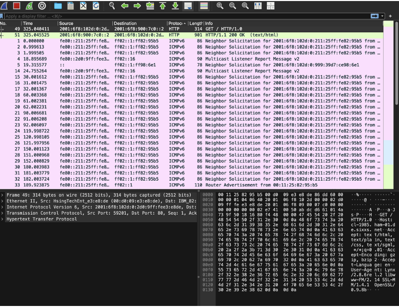
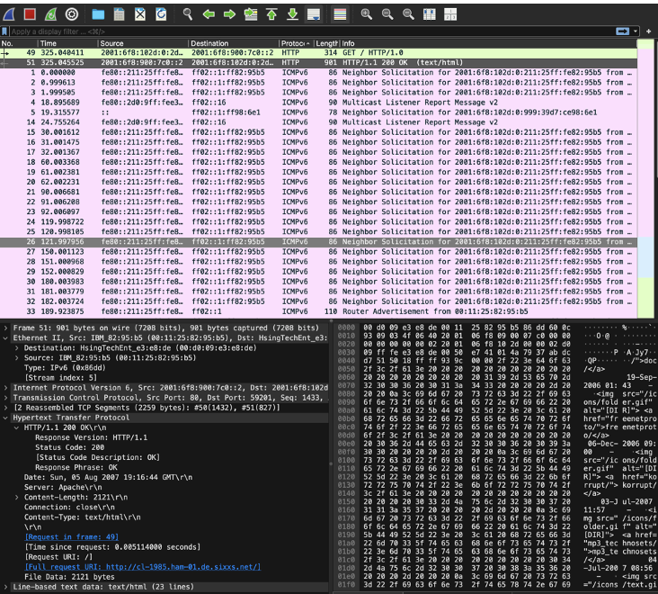
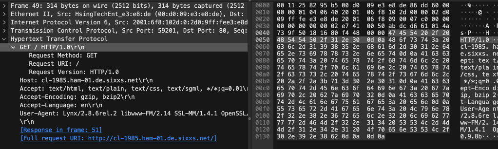
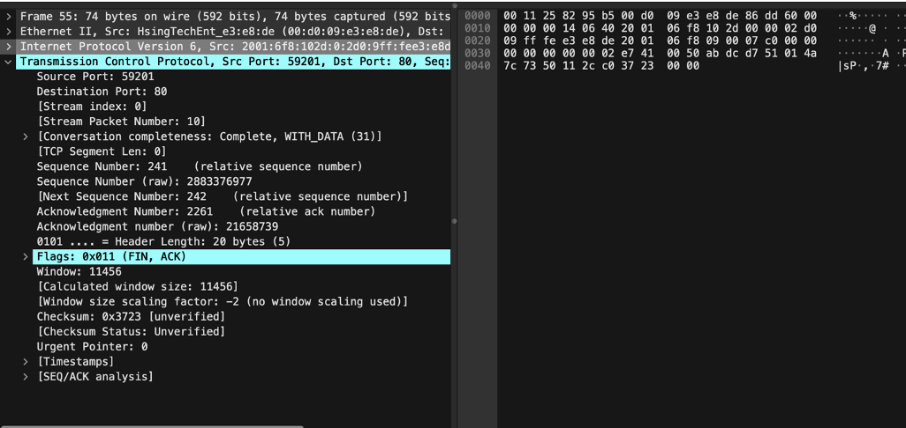
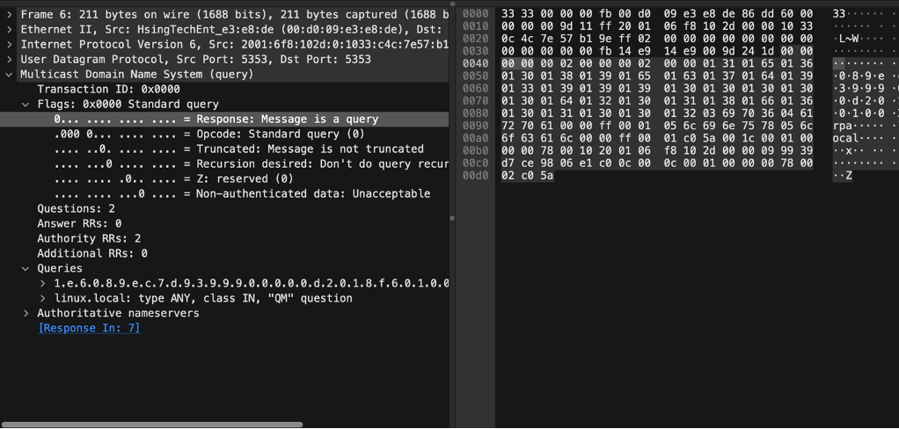
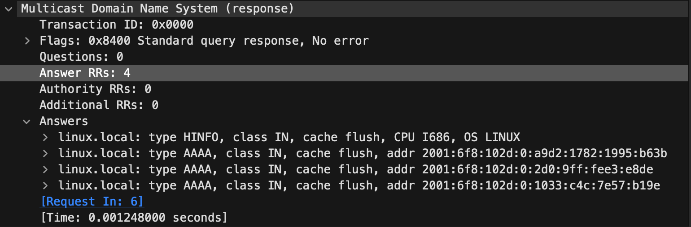
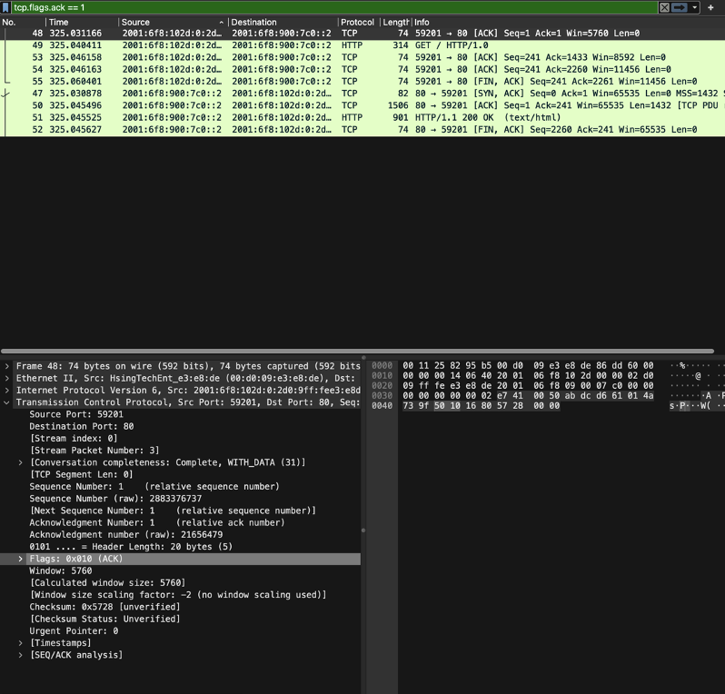

# Wireshark_Network_Traffic_Capture
Detailed Wireshark analysis of IPv6 network traffic showing TCP handshake, HTTP GET request, server response, session teardown, and multicast DNS queries. This project helps understand network protocols and traffic patterns for cybersecurity and network analysis.

# 🛰️ Network Capture Insights: IPv6 HTTP Traffic

**File Name:** v6-http.cap  
**Source:** Wireshark SampleCaptures  
**Tool Used:** Wireshark  
**Objective:** Analyze captured network traffic for patterns, protocols, and anomalies.

---

## 🔎 Packet 49 – HTTP GET Request
This packet shows a client making a standard HTTP GET request to the server’s root page ("/") using IPv6. It reflects a typical web request over HTTP/1.0, using global unicast addresses.

**Why This Matters:**  
- Understanding HTTP GET requests is key for network and web traffic analysis.  
- Shows adoption of IPv6 addressing in web communication.  
- Useful in detecting anomalies in normal browsing behavior.  

---

## 🧾 Packet 51 – HTTP 200 OK Response
This is the server's response to Packet 49. It confirms the server delivered the requested resource correctly over HTTP/1.1.

**Details:**  
- Protocol: HTTP/1.1  
- Content-Type: text/html  
- Content Length: 23 lines of HTML  
- Port: TCP 80  
- IPv6 Addressing  

---

## 🌐 TCP Port 80 Filter Analysis  
A full web request session was captured using the filter:  

tcp.port == 80

## 📍 TCP Handshake (Packets 46–48)

The session begins with a standard 3-way TCP handshake.

📷 Image: (Packet 46 SYN Handshake)  

## 📤 HTTP GET Over IPv6 – Packet 49 (Details)

Flags: 0x018 (PSH, ACK) – confirms data transfer initiated.

📷 Image: (TCP Flags View of Packet 49)  

# HTTP Header Breakdown

GET / HTTP/1.0
Host: cl-1985.ham-01.de.sixxs.net
Accept: text/html, text/plain, text/css, text/sgml, /;q=0.01
Accept-Encoding: gzip, bzip2
Accept-Language: en
User-Agent: Lynx/2.8.6rel.2 ...

📷 Image: (Full GET Header View)  

# HTTP Response & Session Termination (Packets 50–55)

- Packets 50–51: 200 OK, content returned.  
- Packets 52–55: ACK and FIN, proper TCP teardown.

📷 Image: (Frame 55 FIN/ACK)  

# Multicast DNS (mDNS) Query – Packet 6

A reverse lookup request using IPv6 MDNS to resolve device hostnames like linux.local.

📷 Image: (Packet 6 MDNS Query)  

# Additional mDNS Traffic – Packets 8–13

- Redundant queries typical of multicast traffic.  
- AAAA, PTR, and HINFO records included in responses.

📷 Image: (Packet 7 MDNS Response)  

## 🔁 TCP ACK Flow – Packets 48–52
These packets illustrate flow control and acknowledgment during the TCP session.

📷 **Packet 48 ACK Flag**  

## ✅ Summary
This analysis showcases:
- A complete TCP/HTTP communication session over IPv6.
- Handshake → Request → Response → Termination flow.
- Proper use of Wireshark filters and TCP flag inspection.
- mDNS behavior in IPv6-based local network environments.
